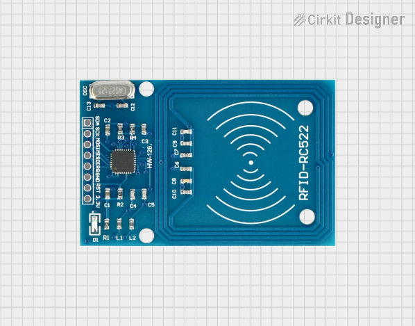
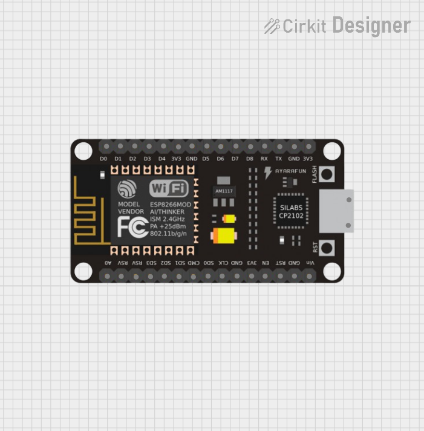
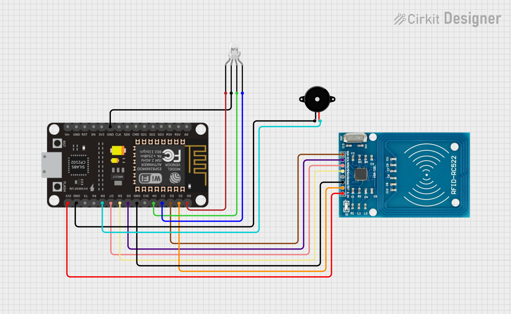
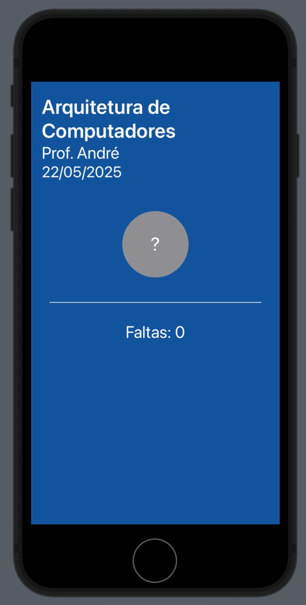
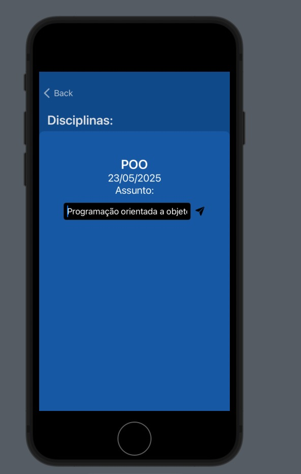
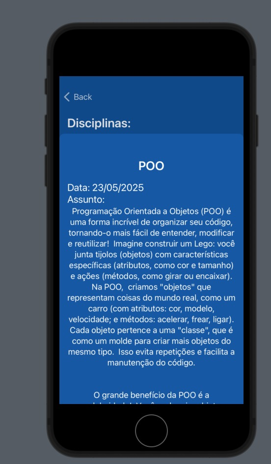
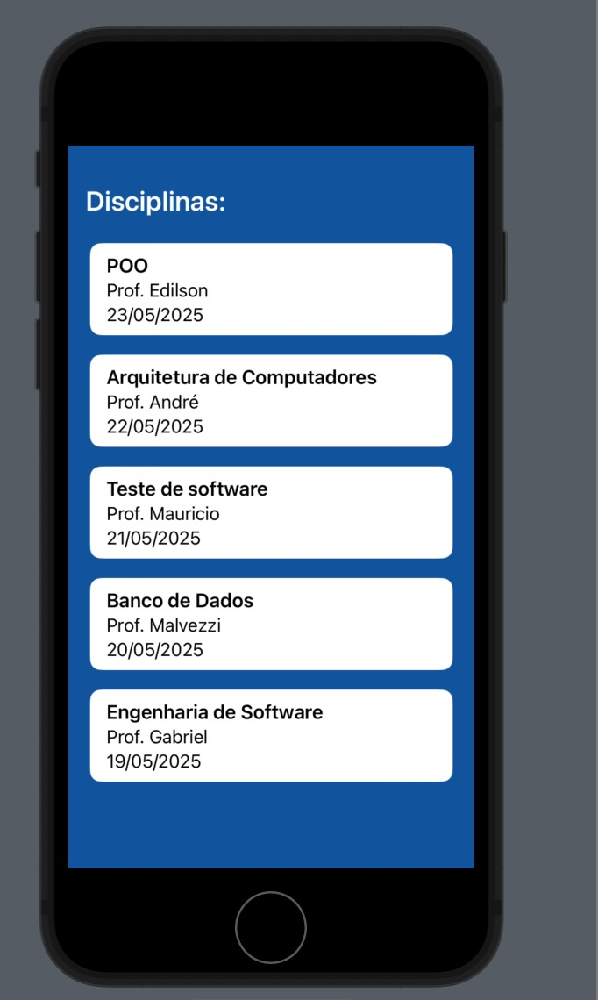
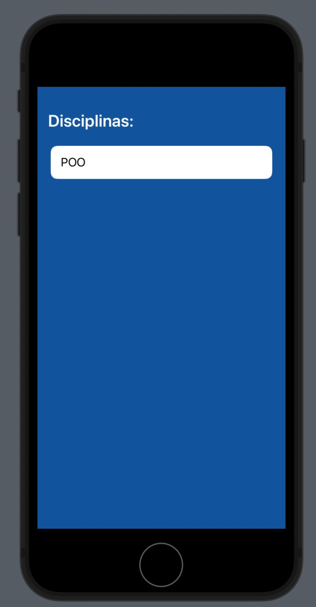
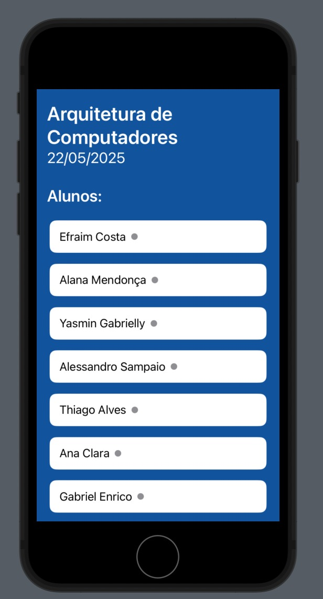

# 🎒 Sistema de Controle de Acesso Escolar com NFC

Este projeto simula um sistema de controle de entrada e saída de alunos em salas de aula, utilizando **NodeMCU ESP8266**, **leitor NFC** e sinalização com **LEDs** e **buzzer**.Além do hardware, conta com um aplicativo mobile desenvolvido em **SwiftUI** e recursos de IA para auxiliar na organização de aulas, promovendo segurança, automação e integração digital no ambiente escolar.

---

## 👨‍💻 Alunos responsáveis:

- [Bruno Lucas Caixeta Braga](https://github.com/bruno2004braga)
- [Efraim de Jesus Farias Costa](https://github.com/efras23)
- [Felipe Gaudereto de Freitas Mello](https://github.com/Mellitoz)
- [Victor Alexandre Praça Maciel](https://github.com/VictorPraca)

---

## 💻 Tecnologias Utilizadas

| Tecnologia       | Função                                                                 |
|------------------|------------------------------------------------------------------------|
| **SwiftUI**       | Desenvolvimento do aplicativo iOS                                      |
| **Arduino IDE**   | Programação do NodeMCU ESP8266                                          |
| **Node-RED**      | Orquestração e integração entre dispositivos e sistemas                |
| **Postman**       | Testes e simulação de requisições HTTP                                 |
| **IBM Cloudant**  | Banco de dados NoSQL para armazenar registros dos alunos e professores |
| **Gemini (IA)**   | Geração automática de conteúdos como assuntos das aulas                |

---

## 🔧 Componentes de Hardware Utilizados

| Componente        | Função                                                         |
|-------------------|----------------------------------------------------------------|
| NodeMCU ESP8266   | Microcontrolador para controle do sistema                      |
| Módulo RC522 NFC  | Leitor dos cartões RFID/NFC                                    |
| LED Azul       | Indica que o sistema está ligado e em funcionamento            |
| LED Verde         | Indica acesso autorizado (entrada válida)                      |
| LED Vermelho      | Indica acesso negado (cartão inválido)                         |
| Buzzer            | Emite sons diferentes para autorizado e não autorizado         |
| Protoboard        | Montagem do circuito sem solda                                 |
| Jumpers           | Cabos de conexão                                               |

---

## 🖼️ Componentes

### Leitor NFC RC522

### NodeMCU ESP8266

### Circuito Completo

---

## ⚙️ Funcionamento do Projeto

1. Aluno aproxima o cartão NFC do leitor.
2. O sistema identifica o UID do cartão.
3. Se o UID for autorizado:
   - Acende LED verde.
   - Toca melodia de dois tons no buzzer.
4. Se o UID não for reconhecido:
   - Acende LED vermelho.
   - Emite 3 bipes curtos e graves no buzzer.
5. O LED branco permanece ligado indicando o sistema em operação.

---

## 📱 Telas do Aplicativo

### 🏠 Home do Aluno

### 🏫 Home Geral

### 👨‍🏫 View do Professor – Geração de Assunto com Gemini

### 📚 View do Aluno – Assunto da Aula

### 📘 View Disciplina – Aluno

### 📘 View Disciplina – Professor

### 🧑‍🎓 View Lista de Alunos (Professor)

---